# Eksport i Import Kawy (Worldwide)

## Podstawowe informacje

Kawa jest jednym z najważniejszych produktów rolnych w handlu
międzynarodowym oraz kluczowym dobrem konsumpcyjnym na rynku globalnym.
Według danych Międzynarodowej Organizacji Kawy (ICO), roczna produkcja
kawy przekracza 170 milionów worków po 60 kg, a wartość światowego rynku
detalicznego szacuje się na setki miliardów dolarów. Mimo swojej
powszechności, rynek kawy charakteryzuje się znaczną złożonością --
zróżnicowane warunki uprawy, różnorodność odmian, fluktuacje cen surowca
oraz rosnące znaczenie jakości i pochodzenia produktu oferują pole do
analizy danych. Wykorzystując publicznie dostępne zbiory danych z
platform analitycznych (Kaggle, ICO, SimpleMaps), zbudowaliśmy
kompleksowy model danych w Power BI, który integruje cztery kluczowe
wymiary analizy: Produkcja i handel międzynarodowy, jakość kawy, ceny
rynkowe oraz zawartość napojów kawowych.\
Zaprojektowany dashboard ma zastosowanie dla różnych grup
interesariuszy. Przedsiębiorstwa kawowe mogą wykorzystać projekt do
identyfikacji nowych dostawców, monitorowania jakości surowca z
poszczególnych regionów oraz analizy trendów cenowych wspierających
decyzje zakupowe i zarządzanie ryzykiem. Konsumenci i entuzjaści kawy
specjalistycznej zyskują dostęp do transparentnych informacji o
pochodzeniu, jakości oraz wartościach odżywczych produktów kawowych. Z
kolei inwestorzy i analitycy rynkowi mogą śledzić kluczowe wskaźniki
wydajności (KPI) rynku kawy.

**Źródła danych (linki do pobrania plików):**
1. [ICO Coffee Dataset (Worldwide)](https://www.kaggle.com/datasets/yamaerenay/ico-coffee-dataset-worldwide)

2. [Caffeine Content of Drinks](https://www.kaggle.com/datasets/heitornunes/caffeine-content-of-drinks)

3. [Coffee Quality database from CQI](https://www.kaggle.com/datasets/volpatto/coffee-quality-database-from-cqi)

4. [Smaplemaps](https://simplemaps.com/data/countries)

5. Icons: https://www.flaticon.com/

-----------------------------------------------------------------------------------------

## Zawartość

1. [Model danych](#model-danych)
2. [Wizualizacje](#wizualizacje)
3. [Dostępność i zasady projektowania](#dostępność-i-zasady-projektowania)
4. [Miary DAX](#miary-dax)
5. [Licencja](#licencja)

-----------------------------------------------------------------------------------------

## Model danych

Do przygotowania dashboardu wykorzystano cztery zbiory danych, na podstawie których utworzono łącznie 6 tabel. \
Dodatkowo utworzono tabelę czasu **Dim_Date** oraz tabelę miar **measure_table**.

Szczegółowy opis danych znajduje się: [tutaj](./documentation/data_structure.md)

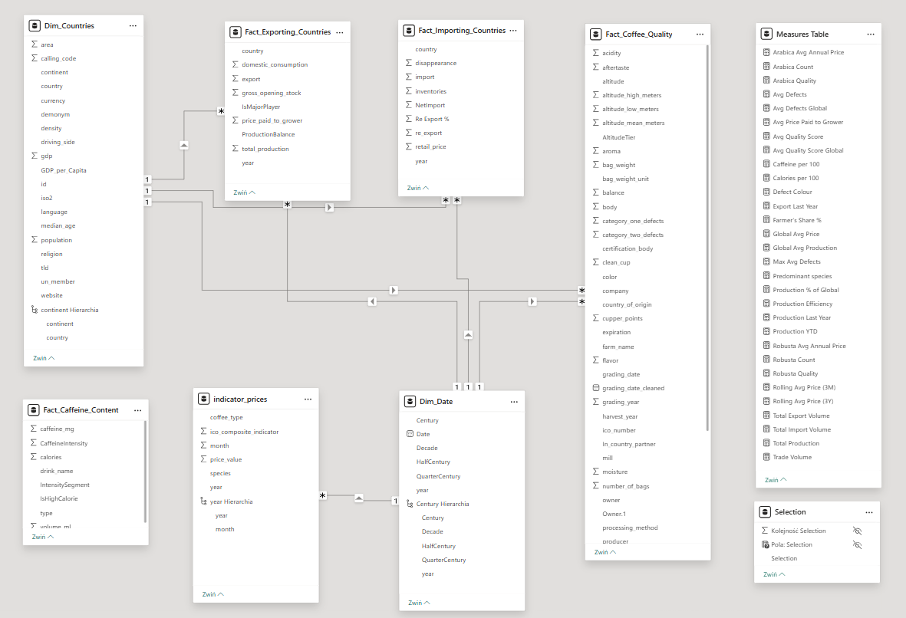

## Wizualizacje

**Strona 1: Dashboard**

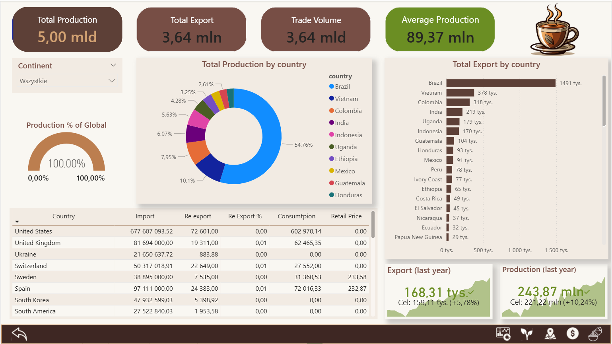

**Strona 2: Coffee Quality**

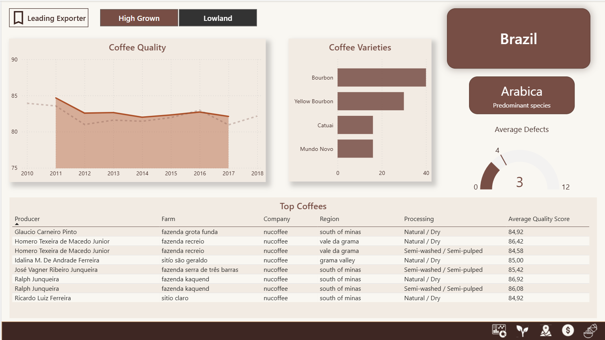

**Strona 3: Map**

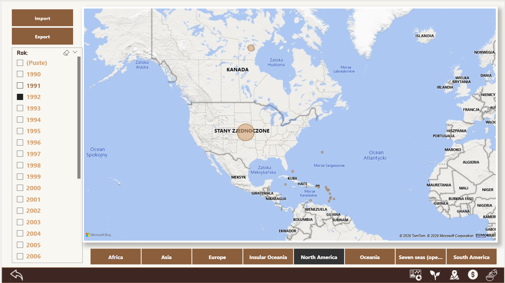

**Strona 4: Global Prices**

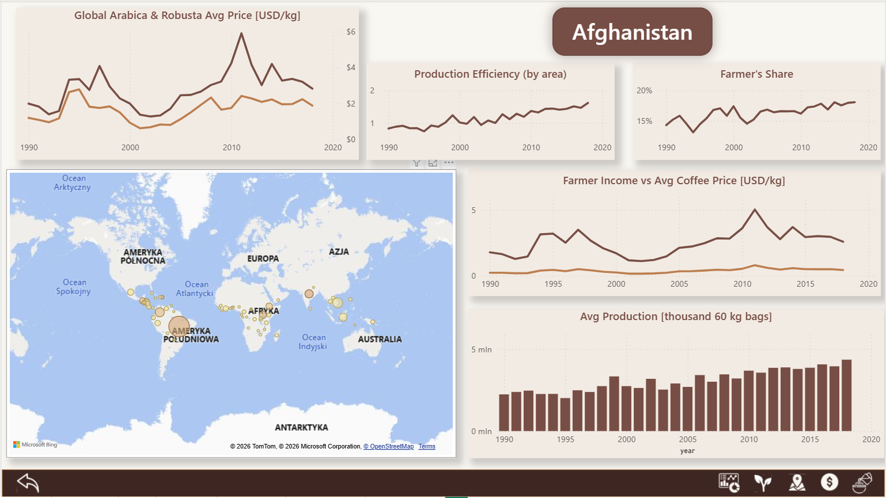

**Strona 5: Drink Contents**

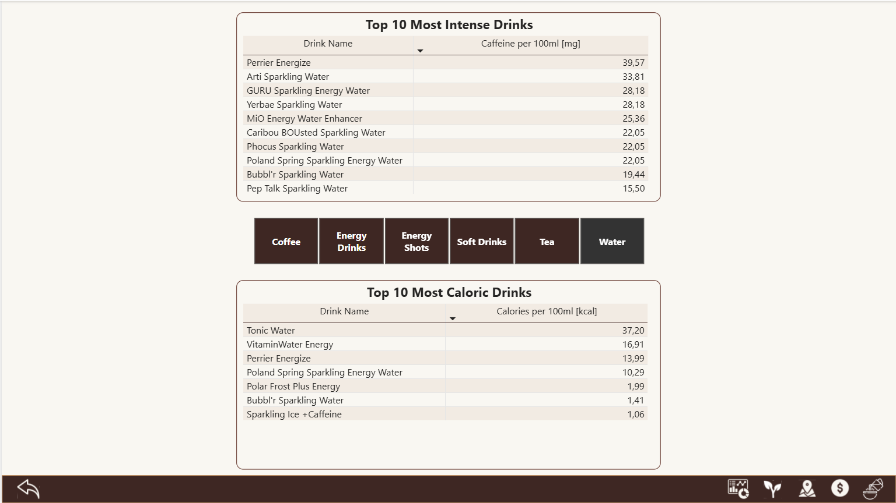

### 5.1 Wykorzystane typy wizualizacji

| Nr | Typ wykresu                  | Cel wykresu / Co przedstawia                                                                                                                                                                                                                                  | Zrzut ekranu             |
| -: | ---------------------------- | ------------------------------------------------------------------------------------------------------------------------------------------------------------------------------------------------------------------------------------------------------------- | ------------------------ |
|  1 | Tooltip                      | Detaliczne informacje o zawartości kofeiny i kaloryczności do napojów z tabeli **Top 10 most Intense Drinks** na karcie **Drink Contents**. Analogiczny tooltip do drugiej tabeli na tej karcie.                                                              | 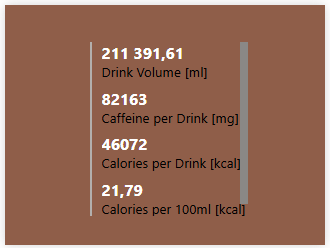  |
|  2 | Tabela                       | Informacje o najwyżej ocenianych odmianach kawy z danego kraju.                                                                                                                                                                                               | 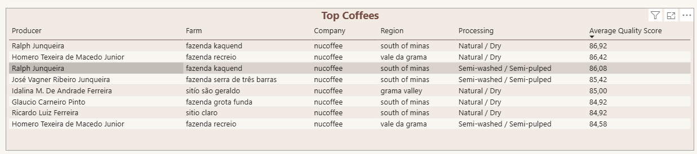  |
|  3 | Wykres pierścieniowy         | Udział produkcji kawy danego kraju w produkcji globalnej / wybranej części globu.                                                                                                                                                                             | 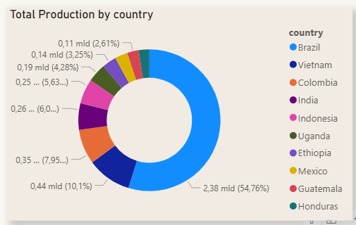  |
|  4 | Wykres słupkowy grupowany    | Eksport kawy każdego kraju w wybranej części globu.                                                                                                                                                                                                           | 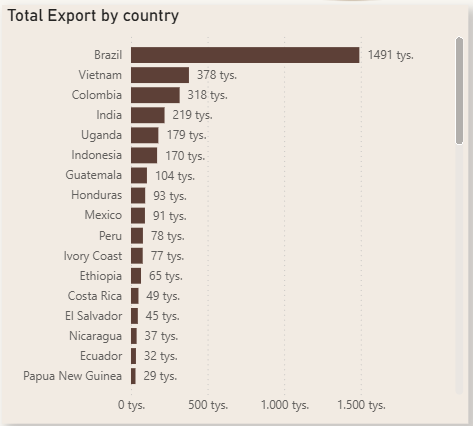 |
|  5 | Karta                        | Wybrany do drążenia wskroś kraj.                                                                                                                                                                                                                              |  |
|  6 | Skumulowany wykres słupkowy  | Rodzaje kawy występujące w wybranym do drążenia wskroś kraju wraz z ilością kaw tych rodzajów.                                                                                                                                                                | 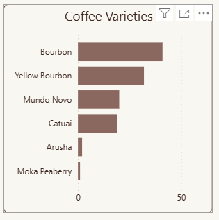 |
|  7 | Miernik                      | Przeciętna ilość defektów dla kawy pochodzącej z wybranego do drążenia wskroś kraju. Wartością docelową jest globalna średnia. W razie jej przekroczenia wykres zmienia kolor. Wartością maksymalną jest średnia defektów kawy z kraju o najwyższej średniej. | 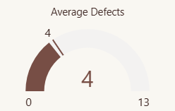 |
|  8 | Wykres warstwowy             | Rozwój średniej oceny jakości kawy w wybranym do drążenia wskroś kraju w porównaniu do globalnej średniej.                                                                                                                                                    | 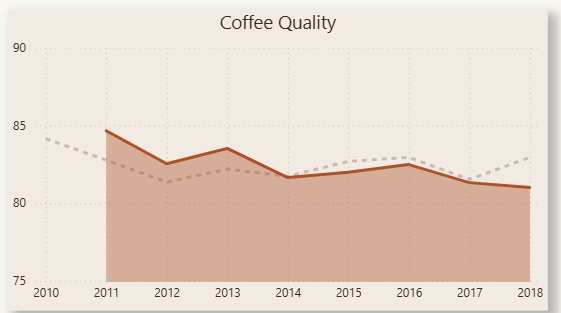 |
|  9 | Kluczowy wskaźnik wydajności | Eksport kawy w wybranej części globu w ostatnim pełnym roku. Celem jest eksport ubiegłego roku. Wizualizacja zmienia kolor zależnie od tego, czy cel osiągnięto.                                                                                              | 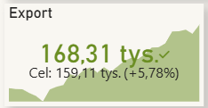 |
| 10 | Mapa                         | Mapa świata z eksportem/importem poszczególnych krajów w wybranym okresie czasowym.                                                                                                                                                                           | 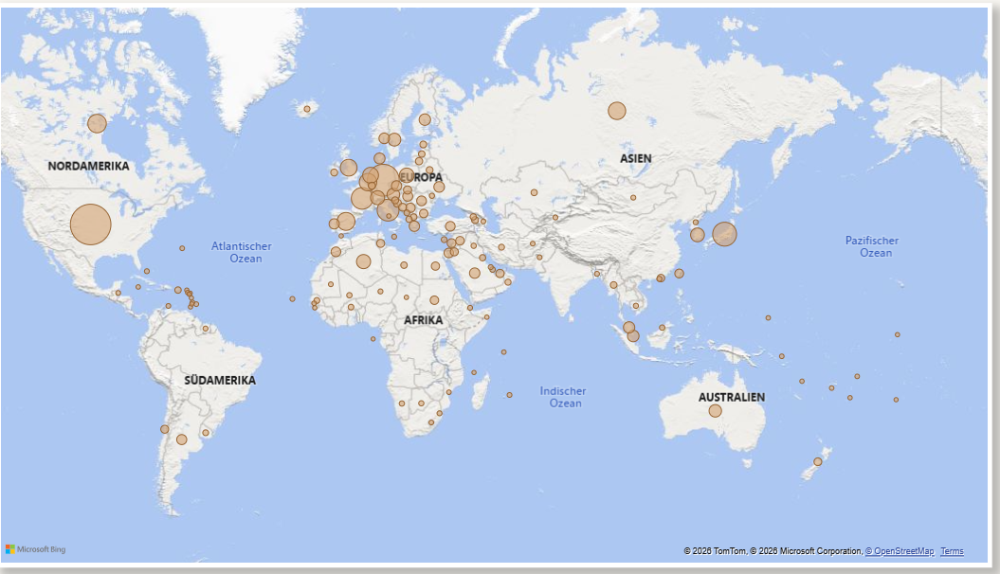 |

### 5.2 Zaawansowane elementy

| Nr | Fragmentatory / Etykiety / Przyciski                            | Opis / Gdzie wykorzystano                                                                                                 | Zrzut ekranu             |
| -: | --------------------------------------------------------------- | ------------------------------------------------------------------------------------------------------------------------- | ------------------------ |
|  1 | Przyciski nawigacji między kartami                              | Na każdej karcie.                                                                                                         |  |
|  2 | Fragmentator Export/Import                                      | Przełącza między wyświetlaniem danych dla Importu i Exportu na mapie.                                                     | 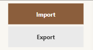 |
|  3 | Fragmentator Roku                                               | Wyświetla dane dla poszczególnych lat na mapie.                                                                           | 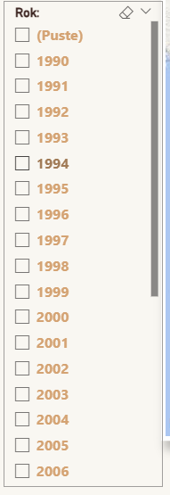 |
|  4 | Przyciski resetu na kartach Dashboard, Map, Contents oraz Price | Resetuje dokonane wybory na danej karcie.                                                                                 |  |
|  5 | Przycisk „Leading Exporter”                                     | Resetuje kartę **Coffee Quality** służącą do drążenia wskroś według kraju do głównego światowego eksportera (Brazylia).   |  |
|  6 | Fragmentator Wysokości Uprawy                                   | Wyświetla dane dla farm kategoryzowanych jako niska/wysoka uprawa na karcie **Coffee Quality**.                           |  |
|  7 | Fragmentator Rodzaju Napoju                                     | Wyświetla dane dla konkretnego napoju na karcie **Contents**.                                                             | 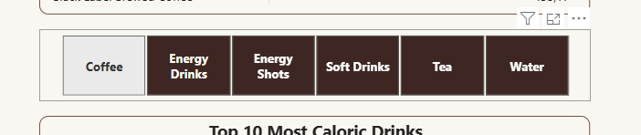 |
|  8 | 2 etykiety                                                      | Pokazuje detaliczne dane o kaloryczności i zawartości kofeiny danego napoju dla wierszy obu tabel na karcie **Contents**. | 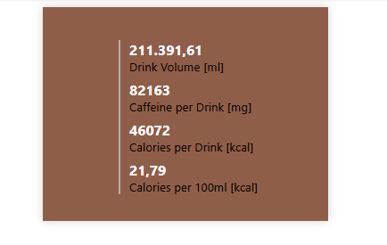 |
|  9 | Fragmentator Kontynentu                                         | Wyświetla dane dla wybranych kontynentów na karcie **Dashboard**.                                                         | 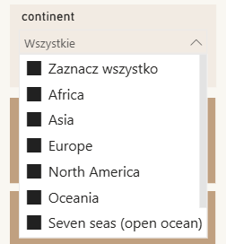 |
| 10 | Fragmentator Kontynentu                                         | Wyświetla dane dla wybranych kontynentów na mapie.                                                                        | 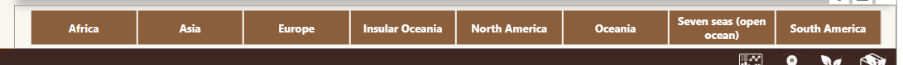 |

## Dostępność i zasady projektowania

**Test kontrastu (coolors.co/contrast-checker):**

Kolor tekstu (HEX): #3E2723

Kolor tła (HEX): #F2EBE3

Wynik testu kontrastu: 11.69

**Test dostępności dla osób z zaburzeniami widzenia barw (Coblis):**

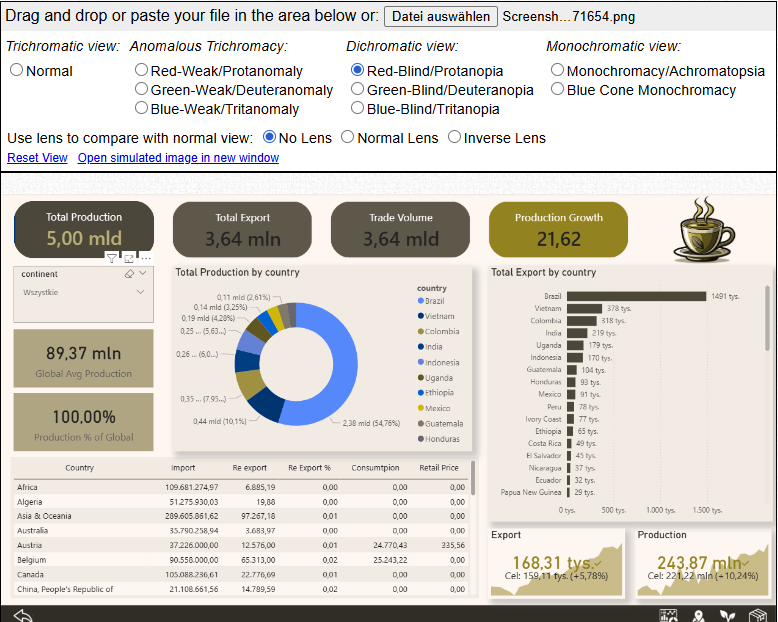

## Nowe kolumny

## Miary DAX

Na potrzeby raportu została utworozna specjalna tabela `measures_table` wraz z niezbędnymi miarami. 

Pełna lista miar: [tutaj](./documentation/measures.md)

## Licencja

Ten projekt powstał w ramach uniwersyteckiego zadania technicznego.

Wszelkie prawa zastrzeżone.
Repozytorium jest udostępniane wyłącznie w celach edukacyjnych i portfolio.

Żadna część tego projektu nie może być kopiowana, rozpowszechniana ani wykorzystywana komercyjnie bez wyraźnej zgody autorów.